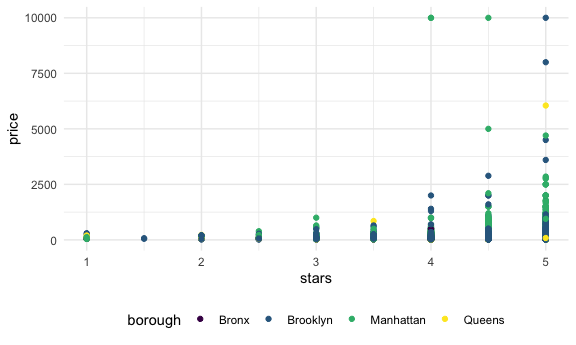
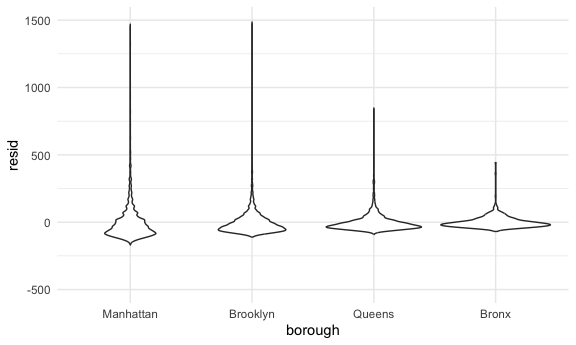

Linear Models
================

## Import data

``` r
data("nyc_airbnb")

nyc_airbnb = 
  nyc_airbnb |> 
  mutate(stars = review_scores_location / 2) |> 
  rename(
    borough = neighbourhood_group,
    neighborhood = neighbourhood) |> 
  filter(borough != "Staten Island") |> 
  select(price, stars, borough, neighborhood, room_type)
```

## Fit a model

``` r
nyc_airbnb %>% 
  ggplot(aes(x = stars, y = price, color = borough)) +
  geom_point()
```

    ## Warning: Removed 9962 rows containing missing values or values outside the scale range
    ## (`geom_point()`).



Let’s fit the model we care about.

``` r
fit = lm(price ~ stars + borough, data = nyc_airbnb)
```

Let’s look at the result

Let’s look at the result better

``` r
broom::glance(fit)
```

    ## # A tibble: 1 × 12
    ##   r.squared adj.r.squared sigma statistic   p.value    df   logLik    AIC    BIC
    ##       <dbl>         <dbl> <dbl>     <dbl>     <dbl> <dbl>    <dbl>  <dbl>  <dbl>
    ## 1    0.0342        0.0341  182.      271. 6.73e-229     4 -202113. 4.04e5 4.04e5
    ## # ℹ 3 more variables: deviance <dbl>, df.residual <int>, nobs <int>

``` r
broom::tidy(fit) %>% 
  select(-std.error, -statistic) %>% 
  mutate(
    term = str_replace(term, "borough", "Borough: ")
  ) %>% 
  knitr::kable(digits = 3)
```

| term               | estimate | p.value |
|:-------------------|---------:|--------:|
| (Intercept)        |  -70.414 |   0.000 |
| stars              |   31.990 |   0.000 |
| Borough: Brooklyn  |   40.500 |   0.000 |
| Borough: Manhattan |   90.254 |   0.000 |
| Borough: Queens    |   13.206 |   0.145 |

## Be in control of factors

``` r
nyc_airbnb =
  nyc_airbnb %>%
  mutate(
    borough = fct_infreq(borough),
    room_type = fct_infreq(room_type)
  )
```

fct_infreq(borough): change to a factor in the order of borough

Look at that plot again

``` r
nyc_airbnb %>% 
  ggplot(aes(x = stars, y = price, color = borough)) +
  geom_point()
```

    ## Warning: Removed 9962 rows containing missing values or values outside the scale range
    ## (`geom_point()`).


``` r
fit = lm(price ~ stars + borough, data = nyc_airbnb)

broom::tidy(fit)
```

    ## # A tibble: 5 × 5
    ##   term            estimate std.error statistic   p.value
    ##   <chr>              <dbl>     <dbl>     <dbl>     <dbl>
    ## 1 (Intercept)         19.8     12.2       1.63 1.04e-  1
    ## 2 stars               32.0      2.53     12.7  1.27e- 36
    ## 3 boroughBrooklyn    -49.8      2.23    -22.3  6.32e-109
    ## 4 boroughQueens      -77.0      3.73    -20.7  2.58e- 94
    ## 5 boroughBronx       -90.3      8.57    -10.5  6.64e- 26

``` r
broom::glance(fit)
```

    ## # A tibble: 1 × 12
    ##   r.squared adj.r.squared sigma statistic   p.value    df   logLik    AIC    BIC
    ##       <dbl>         <dbl> <dbl>     <dbl>     <dbl> <dbl>    <dbl>  <dbl>  <dbl>
    ## 1    0.0342        0.0341  182.      271. 6.73e-229     4 -202113. 4.04e5 4.04e5
    ## # ℹ 3 more variables: deviance <dbl>, df.residual <int>, nobs <int>

Manhattan is the reference group now.

## Diagnostics

``` r
nyc_airbnb %>% 
modelr::add_residuals(fit) %>% 
  ggplot(aes(x = borough, y = resid)) +
  geom_violin() +
  ylim(-500, 1500)
```

    ## Warning: Removed 9993 rows containing non-finite outside the scale range
    ## (`stat_ydensity()`).



``` r
nyc_airbnb %>% 
  modelr::add_residuals(fit) %>% 
  ggplot(aes(x = stars, y = resid)) +
  geom_point() +
  facet_wrap(. ~ borough)
```

    ## Warning: Removed 9962 rows containing missing values or values outside the scale range
    ## (`geom_point()`).


residuals are skewed.

modelr::add_residuals(nyc_airbnb, fit): add a column for residuals
ylim(-500, 1500): zoom in

## Hypothesis tests

This does t-test by default.

``` r
fit %>% 
  broom::tidy()
```

    ## # A tibble: 5 × 5
    ##   term            estimate std.error statistic   p.value
    ##   <chr>              <dbl>     <dbl>     <dbl>     <dbl>
    ## 1 (Intercept)         19.8     12.2       1.63 1.04e-  1
    ## 2 stars               32.0      2.53     12.7  1.27e- 36
    ## 3 boroughBrooklyn    -49.8      2.23    -22.3  6.32e-109
    ## 4 boroughQueens      -77.0      3.73    -20.7  2.58e- 94
    ## 5 boroughBronx       -90.3      8.57    -10.5  6.64e- 26

What about the significance of `borough`.

``` r
fit_null = lm(price ~ stars, data = nyc_airbnb)
fit_alt = lm(price ~ stars + borough, data = nyc_airbnb)

anova(fit_null, fit_alt) %>% 
  broom::tidy()
```

    ## # A tibble: 2 × 7
    ##   term                    df.residual     rss    df   sumsq statistic    p.value
    ##   <chr>                         <dbl>   <dbl> <dbl>   <dbl>     <dbl>      <dbl>
    ## 1 price ~ stars                 30528  1.03e9    NA NA            NA  NA        
    ## 2 price ~ stars + borough       30525  1.01e9     3  2.53e7      256.  7.84e-164

## Nest data, fit models

This is pretty formal and also complex.

``` r
fit = lm(price ~ stars + borough + room_type * borough, data = nyc_airbnb)

broom::tidy(fit)
```

    ## # A tibble: 13 × 5
    ##    term                                  estimate std.error statistic  p.value
    ##    <chr>                                    <dbl>     <dbl>     <dbl>    <dbl>
    ##  1 (Intercept)                              121.      11.8      10.3  1.01e-24
    ##  2 stars                                     21.8      2.42      8.97 3.06e-19
    ##  3 boroughBrooklyn                          -55.5      2.94    -18.9  2.81e-79
    ##  4 boroughQueens                            -86.7      5.66    -15.3  1.09e-52
    ##  5 boroughBronx                            -108.      14.9      -7.27 3.78e-13
    ##  6 room_typePrivate room                   -125.       2.99    -41.7  0       
    ##  7 room_typeShared room                    -154.       8.69    -17.7  9.81e-70
    ##  8 boroughBrooklyn:room_typePrivate room     32.4      4.31      7.51 5.97e-14
    ##  9 boroughQueens:room_typePrivate room       56.0      7.44      7.52 5.60e-14
    ## 10 boroughBronx:room_typePrivate room        71.6     18.0       3.98 7.03e- 5
    ## 11 boroughBrooklyn:room_typeShared room      48.1     13.9       3.46 5.34e- 4
    ## 12 boroughQueens:room_typeShared room        60.7     17.9       3.40 6.72e- 4
    ## 13 boroughBronx:room_typeShared room         85.4     42.4       2.01 4.41e- 2

This is more exploratory but maybe easier to understand.

``` r
nyc_airbnb %>% 
  nest(data = -borough) %>% 
  mutate(
    models = map(.x = data, ~lm(price ~ stars + room_type, data = .x)),
    results = map(models, broom::tidy)
  )  %>% 
  select(-data, -models) %>% 
  unnest(results) %>% 
  filter(term != "(Intercept)") %>% 
  select(borough, term, estimate) %>% 
  pivot_wider(
    names_from = borough,
    values_from = estimate
  )
```

    ## # A tibble: 3 × 5
    ##   term                   Bronx Queens Brooklyn Manhattan
    ##   <chr>                  <dbl>  <dbl>    <dbl>     <dbl>
    ## 1 stars                   4.45   9.65     21.0      27.1
    ## 2 room_typePrivate room -52.9  -69.3     -92.2    -124. 
    ## 3 room_typeShared room  -70.5  -95.0    -106.     -154.

Let’s nest even more.

``` r
nyc_airbnb %>% 
  filter(borough == "Manhattan") %>% 
  nest(data = -neighborhood) %>% 
  mutate(
    models = map(.x = data, ~lm(price ~ stars + room_type, data = .x)),
    results = map(models, broom::tidy)
  )  %>% 
  select(-data, -models) %>% 
  unnest(results) %>% 
  filter(str_detect(term, "room_type")) %>% 
  ggplot(aes(x = neighborhood, y = estimate)) +
  geom_point() +
  facet_wrap(. ~ term) +
  theme(axis.text.x = element_text(angle = 90, vjust = 0.5, hjust = 1))
```


fit the model in different neighborhood.
